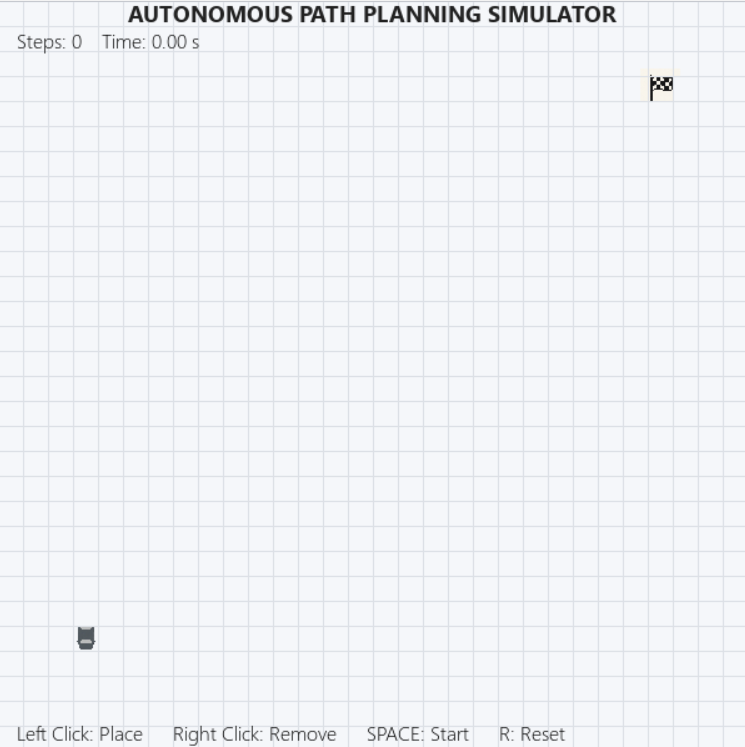
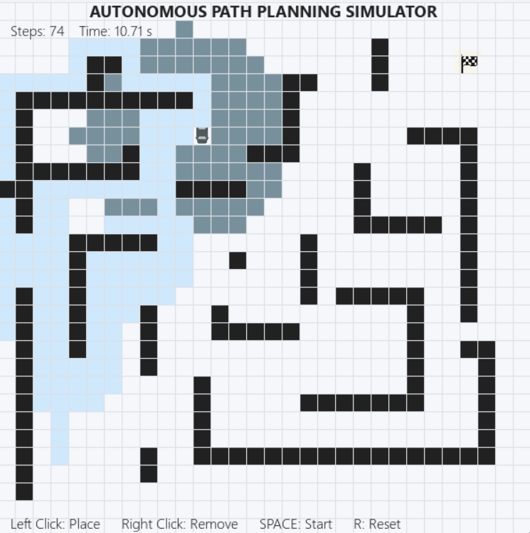
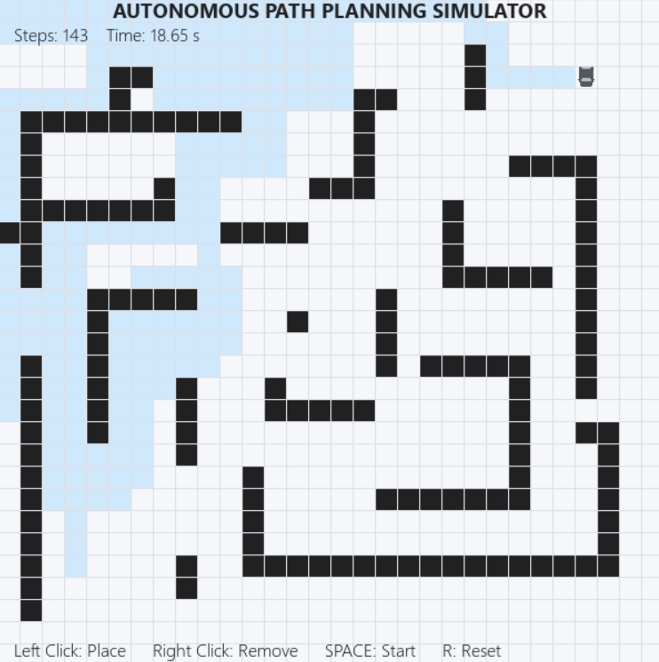

# 🚗 Autonomous Vehicle Path Planning Simulator  
*A\* with LIDAR-style visibility & real-time dynamic replanning*

> **An interactive simulation of real-world autonomous vehicle (AV) path planning and dynamic obstacle avoidance, built with Python & Pygame.**  
>
> This project simulates key AV logic, including LIDAR-style perception, A\* pathfinding with frontier exploration, and real-time dynamic replanning - all visualized step-by-step in an educational interface.
> **Built as part of a robotics portfolio to showcase algorithmic thinking, autonomy, and real-time decision-making.**

---


*Above: Live exploration, dynamic replanning, and HUD in action.*

---
 
## Table of Contents

- [Features](#features)
- [Demo Videos & Screenshots](#demo-videos--screenshots)
- [Why This Matters](#why-this-matters)
- [How It Works](#how-it-works)
- [Quickstart](#quickstart)
- [Project Structure](#project-structure)
- [How to Use](#how-to-use)
- [Technical Details](#technical-details)
- [Development Log](#development-log)
- [Further Ideas](#further-ideas)
- [Limitations](#️-limitations)
- [License](#license)

---

##  🚀 Features

- **Real-time, grid-based path planning** using A* (with future expansion for Dijkstra, RRT, PRM, etc.)
- **LIDAR-style limited perception:** Vehicle “sees” and plans only within a configurable sensor radius
- **Fully autonomous frontier exploration:** The vehicle intelligently explores and discovers goals outside its initial perception, backtrack, and recover from dead ends
- **Dynamic replanning:** Obstacles can be added/removed at any time - vehicle replans in real time
- **Interactive UI:** Place start, goal, and obstacles with mouse; reset and control with keyboard
- **Professional HUD:** Steps, elapsed time, and all controls always visible, non-intrusive
- **Robust and realistic:** Handles complex mazes, backtracking, unreachable goals, and urban-style layouts
- **Polished visualization:** Custom icons, smooth grid, modern fonts, clean color palette

---

## 📽️ Demo Videos & Screenshots

###  **Demo Video**
<a href="https://drive.google.com/file/d/1eHsxObNF8PpTROnrFX22IuVbGq-1tNkz/view?usp=sharing" target="_blank">
  
</a>


- *Shows LIDAR exploration, dynamic replanning, and UI in a real scenario.*

###  **Screenshots**
| Initial Setup        | Dynamic Replanning        | Successful Goal Reach |
|----------------------|--------------------------|----------------------|
|  |  |  |

> *Add your own demo GIF, video, and screenshots in the `docs/` folder for maximum impact!*

---

## 🌍 Why This Matters

Path planning is a core pillar of autonomous vehicle systems.  
This project demonstrates how AVs make real-time decisions based on limited sensor input, dynamically adapt to obstacles, and efficiently reach their destinations - all without human intervention.

By simulating frontier-based exploration and A* planning under sensor constraints, this project mirrors real-world AV challenges like:

- Navigating unknown or partially observable environments
- Replanning around dynamic obstacles (e.g. cars, pedestrians)
- Making fast decisions under time and compute constraints

It also highlights critical AV system design skills:
- **Algorithm design**
- **Perception integration**
- **Decision logic**
- **Real-time visualization and debugging tools**
---

## 🧠 Applications
This simulation captures the core logic used in:
- Self-driving vehicle navigation (urban & off-road)
- Robotics pathfinding in unknown environments
- Search & rescue robot planning
- Teaching core concepts of AI, perception, and control

---

## 🕹️ How It Works

1. **Build your map:**  
   Place the car (start), flag (goal), and any obstacles on the grid with your mouse.

2. **Press SPACE:**  
   The vehicle begins autonomous exploration-planning paths using A* within its LIDAR radius, searching for frontiers if the goal isn’t visible.

3. **Dynamic world:**  
   Add or remove obstacles even while the agent is moving. The vehicle instantly replans to find a new route, just like a real AV would.

4. **Reach the goal:**  
   The car navigates to the flag, backtracking and exploring until it succeeds, or reports if the path is blocked.

---

## ⚡ Quickstart

### 1. **Clone the repo**
```
git clone https://github.com/IvanMcCauley/Project_Path-Planner-Simulation.git
cd Project_Path-Planner-Simulation
```

### 2. **Install dependencies**
```
pip install pygame
```


### 3. **Run the simulation**
```
python main.py
```

## 📁 Project structure
```
path_planner_sim/
│
├── main.py           # Main simulation and UI logic
├── astar.py          # A* pathfinding and support algorithms
├── car.png           # Car icon
└── flag.png          # Goal/flag icon
```

## 🕹️ How to Use

**Controls:**
- **Left Click** - Place (start, goal, barrier)
- **Right Click** - Remove/reset any node
- **SPACE** - Start autonomous exploration
- **R** - Reset the simulation

**Tips:**
- Place barriers to create complex environments - try “mazes”, “urban” layouts, or random scatter for realism.
- While the car is moving, add barriers in its path to demonstrate dynamic replanning.

---

## 🛠️ Technical Details

**Algorithm:**
- A* pathfinding with Manhattan distance heuristic
- Search is restricted to the vehicle’s “visible” grid via LIDAR emulation
- Frontier-based exploration for discovering hidden goals
- Persistent memory with an explored set

**Visualization:**
- Clean Pygame grid with modern colors and smooth animation
- Icons for car and flag, clear color-coded states (explored, path, frontier, etc.)
- Semi-transparent HUD and instructions for a professional finish

**Performance:**
- Handles real-time interaction and rapid replanning
- 60 FPS for smooth user experience

---

## 📝 Development Log

See [`LOG.md`](dev_log.md) for the step-by-step build and debugging diary, including technical challenges, problem-solving, and final polish.

---

## 💡 Further Ideas
- Add alternative planners (Dijkstra, RRT)
- Cost-to-go heatmap visualization
- Diagonal or curved movement options
- Exportable path data/logs
- …and more! (Pull requests welcome)

---

## ⚠️ Limitations

While this simulator demonstrates key AV path planning logic, some simplifications were made:

- **Grid-based world:** Real vehicles operate in continuous, noisy environments - not discrete cells.
- **Perfect localization:** The agent always knows its position exactly (no drift or noise modeled).
- **Simplified LIDAR model:** Sensor visibility is range-based and omnidirectional - no real beam physics.
- **No moving obstacles:** Dynamic agents (e.g. pedestrians, cars) aren’t yet simulated.
- **A\* only:** The current planner doesn’t support non-holonomic constraints, curves, or time-based trajectories.

These choices were intentional to focus on core decision logic - future versions could integrate SLAM, real-world sensor input, or more advanced planners (e.g. RRT*, MPC).

---

## 📄 License

This project is licensed under the MIT License.  
See [`LICENSE`](LICENSE) for details.

---
---
## 🙏 Acknowledgements

Inspired by real-world AV challenges and algorithmic planning theory.  
Built independently as part of my robotics portfolio.  
Open to contributions, forks, and collaboration!

--

**Created by Ivan McCauley**  
[LinkedIn](https://www.linkedin.com/in/ivan-mccauley-82b17a177) | [GitHub](https://github.com/IvanMcCauley)

